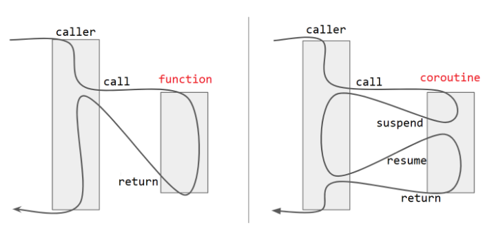

<!-- _class: first-slide -->
---
# C++ Training
## Coroutines
<!-- _class: second-slide -->
---
## Async
- Waiting on external resources
    - Network calls
    - Disk I/O
    - Timers
- CPU mostly idle while waiting
- avoid blocking threads
---
## Traditional Async APIs
- State is split across lambdas / function objects
- User manages lifetime manually
- Error-prone and hard to follow
---
## Callback hell
```cpp
socket.async_read(buf1, [this](error_code ec, size_t n) {
    if (!ec) {
        socket.async_read(buf2, [this](error_code ec, size_t n) {
            if (!ec) {
                process(buf1, buf2);
            }
        });
    }
});
```
---
## Traditional Async APIs
- Nested lambdas
- Manual error handling at each level
- Lifetimes must be carefully managed
- Hard to reason about program flow
---
## Lifetime issue
Local variable captured by reference
```cpp
void foo(tcp::socket& socket)
{
    std::string msg = "hello";

    socket.async_write_some(
        buffer(msg),
        [&](auto ec, auto len)
        {
            log("sent " + msg);   // <-- BUG
        });
}
```
---
Wrong usage of shared_ptr
```cpp
class Session : public std::enable_shared_from_this<Session>
{
public:
    void start()
    {
        //auto self = shared_from_this();
        socket_.async_read_some(
            boost::asio::buffer(buffer_),
            [this](error_code ec, size_t n)
            {
                if (!ec)
                    handle_data(n);
            });
    }
};
auto session = std::make_shared<Session>(...);
session->start();
```
---
## Coroutines
- “pause” the function and resume when data arrives
- keeps logic linear
- no callbacks 
- no lifetime management
---
## C++ Coroutine
- a function 
- can suspend execution
- resume from the suspension point
- maintains state across suspends
- Stackless
    - No dedicated stack
    - Suspension points explicit
    - Locals stored on the heap
    - More lightweight
    - Compiler transforms the function
---
## C++ Coroutine
Other languages (Python, C#, Rust async, etc.) often imply scheduling semantics when you await. 
But in C++20:
- no runtime scheduler
- a coroutine ≈ compiler-generated state machines

This is **key** to understand a lot of otherwise confusing looking syntax

---
## Coroutine flow

https://vishalchovatiya.com/posts/cpp20-coroutine-under-the-hood/

---
## Where Is the coroutine state stored?
- Compiler rewrites the function
- Creates a state machine object
- Local variables become fields
- stack frame becomes heap-allocated state(!)
---
## Coroutines:
- async operations written as normal code
- automatic lifetime handling
- clearer control flow
- efficient I/O-bound concurrency
New language keywords:
- co_yield
- co_return
- co_await
---
## co_yield , co_return
```cpp
Generator<int> count_to_three()
{
    int v = 0;
    co_yield ++v; //suspend
    co_yield ++v; //suspend
    co_yield ++v; //suspend
    co_return;   // signals completion (optional but explicit)
}

int main()
{
    //resume, suspend
    for (int value : count_to_three())
        std::cout << value << "\n";
}
```
---
```cpp
template<typename T>
struct Generator {
    struct promise_type;
    using handle_type = std::coroutine_handle<promise_type>;
    struct promise_type {
        std::optional<T> current_value;
        Generator get_return_object() {
            return Generator{handle_type::from_promise(*this)};
        }
        std::suspend_always initial_suspend() { return {}; }
        std::suspend_always final_suspend() noexcept { return {}; }
        std::suspend_always yield_value(T value) {
            current_value = value;
            return {};
        }
        void return_void() {}     // used when co_return; is called
        void unhandled_exception() { std::terminate(); }
    };
    handle_type handle;
    explicit Generator(handle_type h) : handle(h) {}
    ~Generator() { if (handle) handle.destroy(); }
    struct Iterator
    {
        handle_type handle;
        bool done;
        void operator++() {
            handle.resume();
            done = handle.done();
        }
        T const& operator*() const {
            return *handle.promise().current_value;
        }
        bool operator!=(std::default_sentinel_t) const {
            return !done;
        }
    };
    Iterator begin() {
        handle.resume();
        return Iterator{handle, handle.done()};
    }
    std::default_sentinel_t end() {
        return {};
    }
};
```
---
## promise_type
When the compiler sees a function that uses:
    - co_await
    - co_yield
    - co_return
it transforms the function into a state machine object, called the coroutine frame.
That frame contains an instance of:
```cpp
ReturnType::promise_type
```
the compiler looks up:
```cpp
Generator<int>::promise_type
```
---
promise_type is the interface between user code and compiler generated state machine
```
Caller calls coroutine()
        ↓
Coroutine frame allocated (heap usually)
        ↓
ReturnType::promise_type constructed
        ↓
ReturnType::promise_type::initial_suspend()
        ↓
body executes
        ↓
co_yield (ReturnType::promise_type::yield_value)
        ↓
ReturnType::promise_type::final_suspend()
        ↓
destroy frame

```
---
## initial_suspend
Controls whether the coroutine runs immediately, or starts suspended
- std::suspend_never
- std::suspend_always  

**Required?** Yes
**Why customize?**
    - Generators normally start suspended so the caller decides when to run:
    - Tasks often start immediately instead.

---
## final_suspend
Controls behavior after the coroutine reaches the end or co_return.
Most commonly: std::suspend_always
**Required?** Yes.
- the caller has a chance to observe completion
- destroy the coroutine frame in a controlled way

**Why customize?**
    - Generators usually suspend 
    - Tasks may notify taskmanager of completion

---
## yield_value(T value)
This is called whenever the coroutine hits: co_yield something;
stores the yielded value; schedules suspension

**Required?**
Required for generators,
Not required for coroutines that never use co_yield.

**Why customize?**
- how values are stored (reference vs copy, lifetime)
- buffering
- ownership/lifetime

---
## return_void() / return_value(T)
One of these must exist.
Called when: co_return <value>; 
(or end of function)

**Required?**
Yes — one of them.
return_void() → void coroutine result
return_value(T) → T result

**Why customize?**
final output
completion signaling
error states

---
## unhandled_exception()
Called if the coroutine body throws an exception that is not caught inside the coroutine
**Required?** Yes. 

Typical behavior:
store exception
rethrow on resume
terminate

---
## return_xxxx vs final_suspend 
They solve different problems:
- Deliver the coroutine’s final result: return_value / return_void
- Decide whether to suspend before destruction: final_suspend
logical completion vs lifecycle control
---
## resume(): Teleporting between domains
resume(): execute a transition between two different domains:
- Stackful Domain: The caller's thread stack where standard function calls live.
- Stackless Domain: The coroutine's heap-allocated state machine.
```cpp
Iterator begin() {
    handle.resume();
    return Iterator{handle, handle.done()};
}
```
--- 
## Stackless
- The coroutine has no stack of its own.
- Reuses the caller's stack for temporary calculations 
- Persists into  coroutine Frame.
---
## resume() mental model
- Standard function call
- Pushes a return address to the Caller's Stack
- Does a jmp to IP stored in coro frame
```
// Pseudo-ASM for Caller
push rip + 5  ; Save return address
jmp handle.resume 
; resume() does:
jmp [coro_frame->resume_ptr]
```
---
## co_yield, co_await, co_return mental model
On suspension of the coroutine:
- Update resume_ptr
- Invoke 'ret'
- Ret grabs rip+5 from stack and puts IP there.
- Since coros are stackless cannot grab wrong IP.
```
// Coroutine logic
do_work();
f->resume_ptr = <current_ip>; // Save IP, 
ret; // <--- The Critical Jump 
```
---
## Stackless
- Cannot yield from a nested function call within a coroutine.
- If foo() tried to "yield," --> need to store entire call stack.
- Stackful coroutines (e.g. boost fibers)
```cpp
task coro() {
    nested_func(); // Pushes to stack
}
void nested_func() {
    co_yield 1; // ERROR!
    // No frame to store IP
    // inside this function.
}
```
---
## The metal model
You must understand this or things will be confusing
Resuming is a jump, Suspending is a return
- resume() is called like a normal function. The Return Address (RA) is pushed to the stack.
- The coroutine "resumes" by jumping to its state machine logic via a pointer in the heap.
- The coroutine executes on the caller's stack.f
- On suspension, it saves its logical IP to the heap and executes ret.
- Control flows back to the caller using the RA that was pushed in step 1.
---
```cpp
template typename<T>
struct  GCC_INTERNAL::CoroutineFrame  {
    Generator<T>::promise_type promise; //This is our user defined objects that provide callbacks
    int state = 0; // The "Program Counter" (PC)
    int local_val; // In heap.
    void resume() {
        switch (this->state) {
            case 0: goto ENTRY;
            case 1: goto AFTER_YIELD;
            case 2: goto FINAL;
        }
    ENTRY:
        if (!promise.initial_suspend().await_ready()) {
            this->state = 1; 
            return; // JUMP BACK TO CALLER (Save PC=1)
        }
    AFTER_YIELD:
        this->local_val = 100; // Update heap variable      
        auto awaiter = promise.yield_value(this->local_val); // user callback
        if (!awaiter.await_ready()) {
            this->state = 2; // Save PC for next time
            return; // JUMP BACK TO CALLER (Save PC=2)
        }
    AFTER_RESUME_2:
        promise.return_void();  // user callback
        goto FINAL;
    FINAL:
        promise.final_suspend(); // user callback
    }
};
```
---
## C++23 std::generator
```cpp
#include <generator>
#include <iostream>
std::generator<int> count()
{
    for (int i = 1; i <= 3; ++i)
        co_yield i;

    co_return;
}
int main()
{
    for (int v : count())
        std::cout << v << "\n";
}
```
---
```cpp
#include <coroutine>
#include <print>
#include <thread>
#include <memory>
struct Generator {
    struct promise_type;
    using handle_type = std::coroutine_handle<promise_type>;

    handle_type coro;

    Generator(handle_type h) : coro(h) {
        std::println("[Thread {}] Generator constructed", std::this_thread::get_id());
    }

    ~Generator() {
        std::println("[Thread {}] Generator destroyed", std::this_thread::get_id());
        if (coro) coro.destroy();
    }

    bool next() {
        std::println("[Thread {}] next(): calling resume()", std::this_thread::get_id());
        coro.resume();
        std::println("[Thread {}] next(): resume() returned", std::this_thread::get_id());

        return !coro.done();
    }

    int value();
};
```
---
C++23 spec: 9.5.4 coroutine definitions
```
An implementation may need to allocate additional storage for a coroutine. This storage is known as the
coroutine state and is obtained by calling a non-array allocation function (6.7.5.5.2). The allocation function’s name is looked up by searching for it in **the scope of the promise type**.
```
---
```cpp
struct Generator::promise_type 
{
    int current_value{};
    static void* operator new(std::size_t sz) {
        std::println("[Thread {}] [operator new] Allocating coroutine frame of size {} bytes",          
            std::this_thread::get_id(), sz);
        return std::malloc(sz);
    }
    static void operator delete(void* ptr, std::size_t sz) {
        std::println("[Thread {}] [operator delete] Freeing coroutine frame of size {} bytes",
            std::this_thread::get_id(), sz);
        std::free(ptr);
    }

    promise_type() {
        std::println("[Thread {}] promise_type constructed", std::this_thread::get_id());
    }
    ~promise_type() {
        std::println("[Thread {}] promise_type destroyed", std::this_thread::get_id());
    }
    Generator get_return_object() {
        std::println("[Thread {}] get_return_object()", std::this_thread::get_id());
        return Generator{ handle_type::from_promise(*this) };
    }
    std::suspend_always initial_suspend() {
        std::println("[Thread {}] initial_suspend()", std::this_thread::get_id());
        return {};
    }
    std::suspend_always final_suspend() noexcept {
        std::println("[Thread {}] final_suspend()", std::this_thread::get_id());
        return {};
    }
    std::suspend_always yield_value(int v) {
        std::println("[Thread {}] yield_value({})", std::this_thread::get_id(), v);
        current_value = v;
        return {};
    }
    void return_void() {
        std::println("[Thread {}] return_void()", std::this_thread::get_id());
    }
    void unhandled_exception() {
        std::println("[Thread {}] unhandled_exception()", std::this_thread::get_id());
        std::terminate();
    }
};
int Generator::value() {
    return coro.promise().current_value;
}
```
---

```cpp
Generator myGenerator() {
    std::println("[Thread {}] Entering coroutine", std::this_thread::get_id());
    //int big[100]; //400 bytes extra
    co_yield 10;
    co_yield 20;
    co_return;
}

int main() {
    auto gen = myGenerator();
    while (gen.next()) {
        std::println("[Thread {}] Got value: {}", std::this_thread::get_id(), gen.value());
    }
    std::println("[Thread {}] Done", std::this_thread::get_id());
}
```
---
```
//[Thread 126906408617792] [operator new] Allocating coroutine frame of size 432 bytes
[Thread 140313004930880] [operator new] Allocating coroutine frame of size 32 bytes
[Thread 140313004930880] promise_type constructed
[Thread 140313004930880] get_return_object()
[Thread 140313004930880] Generator constructed
[Thread 140313004930880] initial_suspend()
[Thread 140313004930880] next(): calling resume()
[Thread 140313004930880] Entering coroutine
[Thread 140313004930880] yield_value(10)
[Thread 140313004930880] next(): resume() returned
[Thread 140313004930880] Got value: 10
[Thread 140313004930880] next(): calling resume()
[Thread 140313004930880] yield_value(20)
[Thread 140313004930880] next(): resume() returned
[Thread 140313004930880] Got value: 20
[Thread 140313004930880] next(): calling resume()
[Thread 140313004930880] return_void()
[Thread 140313004930880] final_suspend()
[Thread 140313004930880] next(): resume() returned
[Thread 140313004930880] Done
[Thread 140313004930880] Generator destroyed
[Thread 140313004930880] promise_type destroyed
[Thread 140313004930880] [operator delete] Freeing coroutine frame of size 32 bytes
```
---
## lazy ranges vs coroutine
- If your iterator needs an explanatory comment	--> Use a coroutine
- If your iterator is obvious at a glance --> Range is fine
```cpp
std::generator<int> gen()
{
    for (int i = 0; i < 5; ++i)
        co_yield i;

    for (int j = 5; j <= 15; j += 2)
        co_yield j;

    co_return;
}
```
---
```cpp
struct iter {
    int current = 0;

    int operator*() const { return current; }

    iter& operator++() {
        if (current < 4)
            ++current;
        else
            current += 2;
        return *this;
    }

    bool operator!=(const iter&) const {
        return current <= 15;
    }
};
```
---
Create an iterator producer and consume
using std::range

coroutines/ex1.cpp

---
## co_await

Express async logic in sequential style, without blocking.

```cpp
auto n = co_await async_read(socket, buf);
co_await async_write(socket, n);
```
- No callbacks
- Compiler builds the state machine (write after read)

---

co_await suspends the coroutine until **something** is available.

```cpp
int value = co_await something;
```
During suspension:
- coroutine state is stored in the coroutine frame
- coroutine can later be resumed where it left off
- execution returns to the caller (of the coroutine)
---
## Definitions

| Type                  | Purpose                                     |
| --------------------- | --------------------------------------------|
| Awaiting coroutine    |This is the coroutine function that contains the co_await statement and will be (possibly) be suspended.       |
| Awaiter               | Object that implements the await protocol   |
| Awaitable             | expression after co_await. The "thing" you are awaiting (e.g., a timer, a socket, or another task).                   |

---
## The awaitable
has a member operator co_await()
```cpp
struct MyTask {
   auto operator co_await();
};
```
or there is a free operator co_await(MyTask)
```cpp
auto operator co_await(MyTask);
```
or it already implements the Awaiter API directly

---

## The awaiter
```cpp
struct Awaiter {
   bool await_ready();         // result ready or not?
   void await_suspend(h);      // called when suspending h
   T await_resume();           // value returned to awaiting
};
```
Where h is a coroutine handle of the awaiting

---
## Awaiter protocol

| Function              | Purpose                                            |
| --------------------- | -------------------------------------------------- |
| await_ready()         | return `true` to continue without suspension       |
| await_suspend(handle) | executed when suspending (schedule, enqueue, etc.) |
| await_resume()        | executed after resuming, returns result            |
---
An awaiter can also be the awaitable
SimpleAwaitable implements the awaiter interface.
```cpp
struct SimpleAwaitable {
    bool await_ready() { 
        std::println("await_ready");
        return false; 
    }
    void await_suspend(std::coroutine_handle<> h) {
        std::println("await_suspend");
        h.resume();
    }
    int await_resume() {
        std::println("await_resume");
        return 42;
    }
};
```
---
```cpp
std::generator<int> example() {
    int value = co_await SimpleAwaitable{};
    co_yield value;
}
```
```
await_ready
await_suspend
coroutine pauses
coroutine resumes
await_resume
co_yield
```
---
The awaiter is really an interface on what to do when the coroutine is suspended
User defined suspension points:
```cpp
co_await Awaitable{};
```
coroutine state diagram suspension points:
```cpp
std::suspend_always initial_suspend() { return {}; }
std::suspend_always final_suspend() noexcept { return {}; }
```
---
```cpp
struct suspend_always
{
    constexpr bool await_ready() const noexcept { return false; }
    constexpr void await_suspend( std::coroutine_handle<> ) const noexcept {}
    constexpr void await_resume() const noexcept {}
}
struct suspend_never
{
    constexpr bool await_ready() const noexcept { return true; }
    constexpr void await_suspend( std::coroutine_handle<> ) const noexcept {}
    constexpr void await_resume() const noexcept {}
}
```
---
Classic simple task impl
```cpp
Task compute() {
    std::println("entered child task");
    co_return 42;
}

Task parent() {
    std::println("entered parent task");
    int v = co_await compute();
    std::println("result = {}", v);
    co_return 0;
}

int main() 
{
    //cannot use co_await here, main() is not a coroutine.
    parent().start();
}
```
---
```cpp
struct Task { //The awaitable
    struct promise_type {
        std::optional<int> value;
        std::coroutine_handle<> continuation;
        Task get_return_object() {
            return Task{
                std::coroutine_handle<promise_type>::from_promise(*this)};
        }
        std::suspend_always initial_suspend() { return {}; }
        auto final_suspend() noexcept {
            struct Awaiter {
                promise_type* promise;
                bool await_ready() const noexcept { return false; }
                void await_suspend(std::coroutine_handle<>) const noexcept {
                    std::println("await_suspend");
                    if (promise->continuation){
                        std::println("resuming continuation");
                        promise->continuation.resume();
                    }
                }
                void await_resume() const noexcept {}
            };
            return Awaiter{this};
        }
        void return_value(int v) { value = v; }
        void unhandled_exception() { std::terminate(); }
    };
    std::coroutine_handle<promise_type> coro;
    void start() { coro.resume();}
    auto operator co_await() {
        struct Awaiter {
            std::coroutine_handle<promise_type> h;
            bool await_ready() { return false; }
            void await_suspend(std::coroutine_handle<> awaiting) {
                std::println("awaiting suspend");
                h.promise().continuation = awaiting;
                h.resume();
            }
            int await_resume() {
                std::println("awaiting resume");
                return *h.promise().value;
            }
        };
        return Awaiter{coro};
    }
    ~Task() { if (coro) coro.destroy(); }
};
```
---
std::suspend_always is an awaitable like any other

```cpp
SimpleTask other_coroutine() {
    std::cout << "  [other] running step 1\n";
    co_await std::suspend_always{};
    std::cout << "  [other] running step 2\n";
    co_await std::suspend_always{};
    std::cout << "  [other] finishing\n";
}
```
---
Simple:
coroutines/ex2.cpp
coroutines/ex3.cpp

Advanced:
coroutines/ex4.cpp

---
## Timer
```cpp
Task example() {
    std::println("{}:Waiting 1s",getcurtime());
    co_await Timer{std::chrono::seconds(1)};
    std::println("{}:Done!",getcurtime());
    std::println("{}:Waiting 500 ms",getcurtime());
    co_await Timer{std::chrono::milliseconds(500)};
    std::println("{}:Done!",getcurtime());
}
```
```
00:00:15.061:Waiting 1s
00:00:16.061:Done!
00:00:16.061:Waiting 500 ms
00:00:16.561:Done!
```
---
## Awaitable timer class
```cpp
class Timer {
public:
    explicit Timer(std::chrono::milliseconds dur)
        : duration(dur) {}
    bool await_ready() const noexcept {
        return duration.count() == 0;
    }
    void await_suspend(std::coroutine_handle<> h);
    void await_resume() const noexcept {}

private:
    std::chrono::milliseconds duration;
};
```
---
coroutine h is the coroutine that waits for the timer to complete
```cpp
void Timer::await_suspend(std::coroutine_handle<> h) 
{
    int fd = timerfd_create(CLOCK_MONOTONIC, 0);
    if (fd < 0) {
        perror("timerfd_create");
        std::exit(1);
    }
    itimerspec spec{};
    spec.it_value.tv_sec = duration.count() / 1000;
    spec.it_value.tv_nsec = (duration.count() % 1000) * 1'000'000;

    if (timerfd_settime(fd, 0, &spec, nullptr) < 0) {
        perror("timerfd_settime");
        std::exit(1);
    }
    // tell loop to resume h when timer'fd' has completed
    getLoop().addTimer(fd, h);
}
```
---
```cpp
// ---------------- Event Loop ----------------
class EventLoop {
public:
    EventLoop() { epfd = epoll_create1(0); }
    ~EventLoop() { close(epfd); }
    void addTimer(int fd, std::coroutine_handle<> h) {
        epoll_event ev{};
        ev.events = EPOLLIN;
        ev.data.fd = fd;
        epoll_ctl(epfd, EPOLL_CTL_ADD, fd, &ev);
        waiters.push_back({fd, h});
    }
    void run() {
        while (!waiters.empty()) {
            epoll_event ev{};
            int n = epoll_wait(epfd, &ev, 1, -1);
            if (n <= 0) continue;
            // find the waiter
            for (auto it = waiters.begin(); it != waiters.end(); ++it) {
                if (it->fd == ev.data.fd) {
                    uint64_t exp;
                    read(it->fd, &exp, sizeof(exp));
                    close(it->fd);
                    auto coro = it->h;
                    waiters.erase(it);
                    coro.resume();
                    break;
                }
            }
        }
    }
private:
    struct Waiter {
        int fd;
        std::coroutine_handle<> h;
    };
    int epfd;
    std::vector<Waiter> waiters;
};
```
---
# cppcoro

Many coroutine frameworks exist that implement:
    - Tasks
    - Timer
    - Wait for multiple awaitables (and, any etc)
    - threadpool
boost::asio has lots of feastures

---
Create threadpool, with 2 threads that can execute tasks
```cpp
int main() {
    boost::asio::io_context io;
    co_spawn(io, timer_task(1), detached);
    co_spawn(io, timer_task(2), detached);
    co_spawn(io, timer_task(3), detached);
    print("Starting io_context with worker threads");
    std::vector<std::thread> workers;
    int num_threads = 2;
    for (int i = 0; i < num_threads; ++i) {
        workers.emplace_back([&io]{
            io.run();
        });
    }
    for (auto& w : workers)
        w.join();
    print("All tasks finished");
}
```
---
```cpp
awaitable<void> timer_task(int id) {
    auto executor = co_await this_coro::executor;
    boost::asio::io_context& io =
        static_cast<boost::asio::io_context&>(executor.context());
    print("Task {} start", id);
    asio_timer t1(io, std::chrono::seconds(1));
    co_await t1.async_wait(use_awaitable);
    print("Task {} 1 second passed", id);
    asio_timer t2(io, std::chrono::seconds(2));
    co_await t2.async_wait(use_awaitable);
    print("Task {} 2 more seconds passed", id);
    print("Task {} done", id);
}
```
---
You can access threadpool state from within the coroutine body
using a 'ready' awaitable.
coroutine is never suspended.
```cpp
struct executor_awaitable {
    bool await_ready() const noexcept { return true; }

    template<class Promise>
    auto await_suspend(std::coroutine_handle<Promise>) noexcept { }

    template<class Promise>
    auto await_resume(std::coroutine_handle<Promise> h) noexcept {
        return h.promise().get_executor();
    }
};
```
---
```
[23:02:33] [thread 126461318256512] Starting io_context with worker threads
[23:02:33] [thread 126461314856512] Task 1 start
[23:02:33] [thread 126461306463808] Task 2 start
[23:02:33] [thread 126461306463808] Task 3 start
[23:02:34] [thread 126461306463808] Task 2 1 second passed
[23:02:34] [thread 126461306463808] Task 3 1 second passed
[23:02:34] [thread 126461314856512] Task 1 1 second passed
[23:02:36] [thread 126461306463808] Task 2 2 more seconds passed
[23:02:36] [thread 126461306463808] Task 2 done
[23:02:36] [thread 126461314856512] Task 3 2 more seconds passed
[23:02:36] [thread 126461306463808] Task 1 2 more seconds passed
[23:02:36] [thread 126461314856512] Task 3 done
[23:02:36] [thread 126461306463808] Task 1 done
[23:02:36] [thread 126461318256512] All tasks finished
```
---
ex5.cpp
---
<!-- _class: final-slide -->