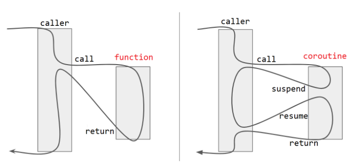

<!-- _class: first-slide -->
---
# C++ Training
## Coroutines
<!-- _class: second-slide -->
---
## Overview
- Why asynchronous control flow is difficult
- How C++ coroutines work
- Producing lazy sequences with generators
- Composing asynchronous operations with tasks
- Managing lifetime, errors, cancellation, and threads
- Applying coroutines with timers and Boost.Asio
---
## Async
- Waiting on external resources
    - Network calls
    - Disk I/O
    - Timers
- CPU mostly idle while waiting
- Avoid blocking worker threads
---
## Traditional Async APIs
- State is split across lambdas / function objects
- Manual lifetime management
- Error-prone and hard to follow
---
## Callback hell
```cpp
socket.async_read(buf1, [this](error_code ec, size_t n) {
    if (!ec) {
        socket.async_read(buf2, [this](error_code ec, size_t n) {
            if (!ec) {
                process(buf1, buf2);
            }
        });
    }
});
```
---
## Traditional Async APIs
- Nested lambdas
- Manual error handling at each level
- Lifetimes must be carefully managed
- Hard to reason about program flow
---
## Lifetime issue
Local variable captured by reference
```cpp
void foo(tcp::socket& socket)
{
    std::string msg = "hello";

    socket.async_write_some(
        buffer(msg),
        [&](auto ec, auto len)
        {
            log("sent " + msg);   // <-- BUG
        });
}
```
---
Wrong usage of shared_ptr
```cpp
class Session : public std::enable_shared_from_this<Session>
{
public:
    void start()
    {
        //auto self = shared_from_this();
        socket_.async_read_some(
            boost::asio::buffer(buffer_),
            [this](error_code ec, size_t n)
            {
                if (!ec)
                    handle_data(n);
            });
    }
};
auto session = std::make_shared<Session>(...);
session->start();
```
---
## Async concerns interact
Making the callback survive is only one part of correctness:

- **Control flow**: what runs next, and in what order?
- **Lifetime**: which objects must remain alive?
- **Threading**: where does the continuation execute?
- **Cancellation**: can completion race with shutdown?
- **Errors**: where are failures observed?

These concerns are orthogonal, but every async operation crosses several of
them at once.

---
## Threading issue
Capturing ownership prevents a dangling object, but not a data race:
```cpp
socket.async_read_some(buffer_,
    [self = shared_from_this()](error_code ec, size_t n) {
        if (!ec)
            self->process(n); // Which thread? Can stop() run concurrently?
    });
```

The callback contract must define its executor or synchronization policy.
Cancellation must also prevent a late callback from using stale state.

---
## What if we could pause a function?
Write the operation in its natural order:
```cpp
Task handle_request() {
    auto request = co_await async_read();
    auto response = process(request);
    co_await async_write(response);
}
```
While waiting, the thread is free to run other work.
When the operation completes, execution continues at the next statement.

---
## What must survive the pause?
To continue later, something must remember:

- Where execution stopped
- Local values still in use
- The result being awaited
- Where completion should continue

The function's call stack cannot remain blocked while it waits.
Its resumable state must live somewhere else.

---
## A resumable state machine
The compiler transforms the function into states separated by suspension points:

```text
start → wait for read → process → wait for write → done
             ↑                         ↑
          resume                    resume
```

- `co_await` may suspend and later resume the function
- state needed after suspension is stored in a coroutine frame
- each resume runs until the next suspension point or completion
---
## What C++ coroutines provide
C++20 provides the language machinery for resumable state machines:

- explicit suspension points
- compiler-generated frame and control flow
- hooks for results, errors, and continuation handling

C++ does **not** provide a scheduler, event loop, thread pool, or cancellation
policy. Libraries supply those pieces.

Coroutines simplify control flow; they do not remove lifetime or threading
responsibilities.

---
## Coroutine flow

https://vishalchovatiya.com/posts/cpp20-coroutine-under-the-hood/

---
## A simple coroutine: suspend and resume
```cpp
Gen demo() {
    std::cout << "[coroutine] start\n";
    co_yield 10;
    std::cout << "[coroutine] after first yield\n";
    co_yield 20;
    std::cout << "[coroutine] after second yield\n";
}

int main() {
    auto g = demo();
    std::cout << "[main] first next\n";
    g.next();
    std::cout << "[main] value = " << g.value() << "\n";
    std::cout << "[main] second next\n";
    g.next();
    std::cout << "[main] value = " << g.value() << "\n";
}
```
---
```text
[main] first next
[coroutine] start
[main] value = 10
[main] second next
[coroutine] after first yield
[main] value = 20
```

This is the key pattern: the coroutine runs, suspends at a `co_yield`, returns
control to `main`, and later resumes at the saved point.

---
## Where Is the coroutine state stored?
- Compiler rewrites the function into a resumable state machine
- Creates an opaque coroutine frame
- Parameters and locals that survive suspension become frame fields
- References remain references: the referenced object must still outlive their use
- Allocation is commonly dynamic, but the compiler may elide or embed it

---
## The parts of a coroutine
Calling a coroutine produces a return object connected to a coroutine frame:

```text
coroutine call --> return object
return object --> coroutine handle --> coroutine frame

coroutine frame contains: state + saved locals + promise
```

- the frame contains the resumable state machine
- the promise is an object inside that frame
- the handle lets the return object resume, inspect, or destroy the frame
---
## The promise: a shared interface
Lets see how the caller interacts with the statemachine
```text
body -- co_yield --> promise.yield_value(...)
body -- co_return --> promise.return_value(...) / return_void()
body -- exception --> promise.unhandled_exception()

caller -- handle.promise() --> promise state and results
```

The promise defines how values, errors, startup, and completion are exposed.
It is the customization interface, not the scheduler or the state machine
itself.

---
## Getting information out of the state machine
A coroutine can produce two kinds of result:
- `co_yield value`: publish an intermediate value, then suspend
- `co_return value`: publish the final result, then finish

```text
resume ──> run ──> co_yield ──> value ──> suspended
resume ──> run ──> co_return ─> result ─> completed
```

We will introduce `co_await` later. It pulls a result from another operation
into the current state machine.

---
## co_yield: publish and (probably) pause
```cpp
Generator<int> count_to_three() {
    int v = 0;
    co_yield ++v;
    co_yield ++v;
    co_yield ++v;
    co_return;
}
int main() {
    for (int value : count_to_three())
        std::cout << value << "\n";
}
```

Each iterator increment resumes the frame. Each `co_yield` exposes one value
through the promise and suspends again.

---
## co_yield: push data to the promise
Conceptually, this:
```cpp
co_yield expression;
```

is transformed into:
```cpp
co_await promise.yield_value(expression);
```

A generator normally suspends after yielding.

---
## co_return: completes the machine
```cpp
co_return value; // calls promise.return_value(value)
co_return;       // calls promise.return_void()
```

After publishing its final result, the coroutine proceeds to `final_suspend`.
It cannot be resumed again, but its frame may remain alive until its owner
observes the result and destroys it.

---
## Exercise: coroutines/ex1.cpp
Use `std::generator` to produce a lazy deployment sequence before looking at
the machinery that implements it.

- Yield `configure`, `build`, `test`, and `deploy` in order.
- Yield `test` only when the caller requests it.
- Collect the stages with `std::ranges::copy` and a back inserter.
- Verify deployments both with and without the test stage.

The standard library supplies the promise, frame ownership, and iterator. The
exercise focuses only on writing and consuming a coroutine.

---
```cpp
template<typename T>
struct Generator {
    struct promise_type;
    struct Iterator;
    using handle_type = std::coroutine_handle<promise_type>;
    struct promise_type {
        std::optional<T> current_value;
        Generator get_return_object() {
            return Generator{handle_type::from_promise(*this)};
        }
        std::suspend_always initial_suspend() { return {}; }
        std::suspend_always final_suspend() noexcept { return {}; }
        std::suspend_always yield_value(T value) {
            current_value = value;
            return {};
        }
        void return_void() {}
        void unhandled_exception() { std::terminate(); }
    };
};
```

---
```cpp
template<typename T>
struct Generator {
    handle_type handle{};
    explicit Generator(handle_type h) noexcept : handle(h) {}
    Generator(Generator const&) = delete;
    Generator& operator=(Generator const&) = delete;
    Generator(Generator&& other) noexcept
        : handle(std::exchange(other.handle, {})) {}
    ~Generator() {
        if (handle)
            handle.destroy();
    }
}
```
`get_return_object()` passes the new frame handle to the constructor. The
returned `Generator` then owns that frame and destroys it exactly once.

---
```cpp
struct Iterator {
    using iterator_concept = std::input_iterator_tag;
    using value_type = T;
    using difference_type = std::ptrdiff_t;
    handle_type handle{};
    bool done = true;
    Iterator& operator++() {
        handle.resume();
        done = handle.done();
        return *this;
    }
    void operator++(int) { ++*this; }
    T const& operator*() const {
        return *handle.promise().current_value;
    }
    friend bool operator==(Iterator const& it, std::default_sentinel_t) {
        return it.done;
    }
};
```

---
```cpp
struct Generator
{
    Iterator begin() {
        if (handle && !handle.done())
            handle.resume();
        return {handle, !handle || handle.done()};
    }
    std::default_sentinel_t end() const noexcept {
        return {};
    }
}
```
`begin()` performs the initial resume and stops at the first `co_yield`.
```text
promise -> get_return_object() -> Generator(handle)
Generator::begin() -> Iterator(handle) -> handle.promise()
```

---
## How the compiler finds the promise to build the Generator
The promise type is selected through:
```cpp
std::coroutine_traits<ReturnType, ParameterTypes...>::promise_type
```
For the generator shown here, the usual nested type resolves to:
```cpp
Generator<int>::promise_type
```
The promise is not the coroutine frame itself. It is an object stored inside
the frame that provides the compiler's customization interface.

---
## Generator lifecycle: putting it together
This is the same pattern as the earlier `count_to_three()` example.

```cpp
Generator<int> count_to_three() {
    co_yield 1;
    co_yield 2;
    co_yield 3;
    co_return;
}
```
---
```text
count_to_three() - called
  --> frame and promise(Generator<int>::promise_type) are created
  --> Generator is returned holding the frame handle
  --> initial_suspend: body has not run yet

begin() / operator++()
  --> resume the frame
  --> co_yield stores current_value and suspends
  --> operator*() reads current_value through the promise

co_return
  --> final_suspend marks execution complete
  --> ~Generator() destroys the frame
```

---
## promise_type implementation
The coroutine body determines which hooks are required:
| Concern | Promise customization point |
| --- | --- |
| Return object | `get_return_object()` |
| Start and completion | `initial_suspend()`, `final_suspend()` |
| Intermediate output | `yield_value(value)` |
| Final output | `return_value(value)` or `return_void()` |
| Uncaught errors | `unhandled_exception()` |
| Await expressions | `await_transform(expression)` *(optional)* |
| Frame allocation | `operator new/delete`, allocation-failure hook *(optional)* |

---
## initial_suspend
Controls whether the coroutine runs immediately, or starts suspended
- std::suspend_never
- std::suspend_always  

**Required?** Yes
**Why customize?**
- Generators normally start suspended so the caller decides when to run
- Tasks often start immediately instead

---
## Eager vs lazy tasks
- `suspend_never`: eager; the body starts during the call
- `suspend_always`: lazy; an owner or awaiter must start it
- eager tasks may complete before the caller receives the return object
- lazy tasks make scheduling and composition explicit

Neither policy is universally correct. The return type's contract must state
when execution starts and who owns an un-awaited task.

---
## final_suspend
Controls behavior after the coroutine reaches the end or co_return.
Most commonly: std::suspend_always
**Required?** Yes.
- the caller has a chance to observe completion
- destroy the coroutine frame in a controlled way
- resuming a coroutine after it reaches final suspend is undefined behavior

**Why customize?**
- Generators usually suspend
- Fire and forget tasks usually do not suspend
- `suspend_never` self-destroys the frame, so no retained handle may be used

---
## yield_value(T value)
This is called whenever the coroutine hits: co_yield something;
stores the yielded value; schedules suspension

**Required?**
Required for generators,
Not required for coroutines that never use co_yield.

**Why customize?**
- how values are stored (reference vs copy, lifetime)
    - ownership/lifetime

---
## return_void() / return_value(T)
```cpp
co_return <value>; 
co_return;
```

**Required?**
`return_void()` → void coroutine result
`return_value(T)` → T result

**Why customize?**
- final output
- completion signaling
- error states

---
## unhandled_exception()
Called if the coroutine body throws an exception that is not caught inside the coroutine
**Required?** Yes. 

Typical behavior:
- store `std::current_exception()` in the promise
- rethrow later
- terminate only for fire-and-forget policies

`unhandled_exception()` itself must not throw.

---
## return_xxxx vs final_suspend 
They solve different problems:
- Deliver the coroutine’s final result: return_value / return_void
- Decide whether to suspend before destruction: final_suspend
pushing data out of the statemachine vs lifecycle control

---
## resume(): resuming the suspended statemachine
`resume()` transfers control from an ordinary call stack into a suspended
coroutine frame:
- the coroutine has no dedicated stack
- it executes on the thread and stack that calls `resume()`
- compiler-generated code uses frame state to select the continuation point
```cpp
Iterator begin() {
    handle.resume();
    return Iterator{handle, handle.done()};
}
```

--- 
## Stackless
- The coroutine has no stack of its own.
- Uses the resuming thread's stack for temporary calculations
- State required across suspension persists in the coroutine frame

---
## Stackless
- Cannot yield from a nested function call within a coroutine.
- If foo() tried to "yield," --> need to store entire call stack.
- Stackful coroutines (e.g. boost fibers)
```cpp
task coro() {
    nested_func(); // Pushes to stack
}
void nested_func() {
    co_yield 1; // ERROR!
    // No frame to store IP inside this function.
}
```

---
## resume() might be confusing
- `resume()` behaves like a normal function call from the caller's perspective
- Compiler-generated code receives the frame address (state is stored there!)
- It dispatches to the saved logical state

The standard does not require a saved instruction pointer, switch, jump,
or particular frame layout. Optimizers may inline or rewrite all of this.

---

## co_yield, co_await, co_return mental model
On suspension of the coroutine:
- Save enough state to identify the next continuation point
- Preserve locals whose lifetimes cross the suspension point
- Return control

```cpp
Generator<int> one_value() {
    int local_val = 100;
    co_yield local_val;
    co_return;
}
```

---
```cpp
template<typename T>
struct CoroutineFrame {
    Generator<T>::promise_type promise;
    int state = 0; // The "Program Counter" (PC)
    int local_val; // In the frame because it crosses a suspension.
    void resume() { //the rewritten body of the coroutine 'one_value'
        switch (this->state) {
            case 0: goto ENTRY;
            case 1: goto AFTER_YIELD;
            case 2: goto AFTER_RESUME_2;
        }
    ENTRY:
        if (!promise.initial_suspend().await_ready() /*should suspend on start?*/) {
            this->state = 1; 
            return;
        }
    AFTER_YIELD:
        this->local_val = 100; // Update heap variable      
        auto awaiter = promise.yield_value(this->local_val); // user callback
        if (!awaiter.await_ready()) {
            this->state = 2; // Save PC for next time
            return;
        }
    AFTER_RESUME_2:
        promise.return_void();  // user callback
        goto FINAL;
    FINAL:
        promise.final_suspend();
    }
};
```

---
## C++23 std::generator
```cpp
#include <generator>
#include <iostream>
std::generator<int> count()
{
    for (int i = 1; i <= 3; ++i)
        co_yield i;

    co_return;
}
int main()
{
    for (int v : count())
        std::cout << v << "\n";
}
```

---
## std::generator details
- It is a synchronous, lazy input range, not an async task
- yielded references are valid only until the generator is advanced
- arbitrary `co_await` is disabled in the generator body
- `std::ranges::elements_of(range)` recursively yields another range

```cpp
std::generator<int> tree_values(Node const& node) {
    co_yield node.value;
    for (Node const& child : node.children)
        //building a new generator tree_value(child)
        //yielding 1 element every pull - by ranges::elements_of
        co_yield std::ranges::elements_of{tree_values(child)};
}
```

---
## Coroutine frame allocation
Lets add some prints to a custom generator and see when which logs
are printed.

---
```cpp
#include <coroutine>
#include <print>
#include <thread>
#include <memory>
struct Generator {
    struct promise_type;
    using handle_type = std::coroutine_handle<promise_type>;
    handle_type coro{};
    Generator(handle_type h) : coro(h) {
        std::println("[Thread {}] Generator constructed", std::this_thread::get_id());
    }
    Generator(Generator const&) = delete;
    Generator& operator=(Generator const&) = delete;
    Generator(Generator&& other) noexcept
        : coro(std::exchange(other.coro, {})) {}
    ~Generator() {
        std::println("[Thread {}] Generator destroyed", std::this_thread::get_id());
        if (coro) coro.destroy();
    }
    bool next() {
        if (!coro || coro.done()) return false;
        std::println("[Thread {}] next(): calling resume()", std::this_thread::get_id());
        coro.resume();
        std::println("[Thread {}] next(): resume() returned", std::this_thread::get_id());
        return !coro.done();
    }
    int value();
};
```

---
C++23 spec: 9.5.4 coroutine definitions
```
An implementation may need to allocate additional storage for a coroutine. 
This storage is known as the coroutine state and is obtained by calling a non-array allocation function (6.7.5.5.2). 
The allocation function’s name is looked up by searching for it in **the scope of the promise type**.
```

The compiler may elide allocation when frame lifetime is strictly nested and
frame size is known at the call site. Do not rely on every coroutine allocating.

---
## Allocation failure
Normally, failure to allocate a coroutine frame throws `std::bad_alloc`.

A promise may instead provide:
```cpp
static Generator get_return_object_on_allocation_failure() noexcept;
```
Then the compiler uses a non-throwing allocation path and returns that object
when allocation fails. 

Custom promise `operator new` can also receive the coroutine's parameters for allocator-aware frame placement.

---
```cpp
struct Generator::promise_type 
{
    int current_value{};
    static void* operator new(std::size_t sz) {
        std::println("[Thread {}] [operator new] Allocating coroutine frame of size {} bytes",std::this_thread::get_id(), sz);
        return std::malloc(sz);
    }
    static void operator delete(void* ptr, std::size_t sz) {
        std::println("[Thread {}] [operator delete] Freeing coroutine frame of size {} bytes",std::this_thread::get_id(), sz);
        std::free(ptr);
    }
    promise_type() {
        std::println("[Thread {}] promise_type constructed", std::this_thread::get_id());
    }
    ~promise_type() {
        std::println("[Thread {}] promise_type destroyed", std::this_thread::get_id());
    }
    Generator get_return_object() {
        std::println("[Thread {}] get_return_object()", std::this_thread::get_id());
        return Generator{ handle_type::from_promise(*this) };
    }
    std::suspend_always initial_suspend() {
        std::println("[Thread {}] initial_suspend()", std::this_thread::get_id());
        return {};
    }
    std::suspend_always final_suspend() noexcept {
        std::println("[Thread {}] final_suspend()", std::this_thread::get_id());
        return {};
    }
    std::suspend_always yield_value(int v) {
        std::println("[Thread {}] yield_value({})", std::this_thread::get_id(), v);
        current_value = v;
        return {};
    }
    void return_void() {
        std::println("[Thread {}] return_void()", std::this_thread::get_id());
    }
    void unhandled_exception() {
        std::println("[Thread {}] unhandled_exception()", std::this_thread::get_id());
        std::terminate();
    }
};
int Generator::value() {
    return coro.promise().current_value;
}
```

---
```cpp
Generator myGenerator() {
    std::println("[Thread {}] Entering coroutine", std::this_thread::get_id());
    //int big[100]; //400 bytes extra
    co_yield 10;
    co_yield 20;
    co_return;
}
int main() {
    auto gen = myGenerator();
    while (gen.next()) {
        std::println("[Thread {}] Got value: {}", std::this_thread::get_id(), gen.value());
    }
    std::println("[Thread {}] Done", std::this_thread::get_id());
}
```

---
## Lifecycle 1/5: create a lazy coroutine
```text
[operator new] Allocating coroutine frame of size 32 bytes
promise_type constructed
get_return_object()
Generator constructed
initial_suspend()
```

1. Allocate the frame, then construct its promise.
2. Create a `Generator` that owns a handle to that frame.
3. Stop at `initial_suspend` before entering `myGenerator()`.

**Interesting:** calling a lazy coroutine executes compiler-generated setup,
but none of the function body.

---
## Lifecycle 2/5: pull the first value
```text
next(): calling resume()
    Entering coroutine
    yield_value(10)
next(): resume() returned
Got value: 10
```

`resume()` runs the body on the caller's thread until `co_yield 10`.
`yield_value()` stores `10`; its `suspend_always` returns control to `next()`.
The caller then reads the promise while the frame is suspended.

```text
caller running -> coroutine running -> caller running
initial_suspend    first co_yield       reads 10
```

---
## Lifecycle 3/5: the pull cycle repeats
```text
next(): calling resume()
    yield_value(20)
next(): resume() returned
Got value: 20
```

The saved continuation is immediately after the first `co_yield`.
Execution continues to the next yield and suspends again.

**The generator protocol is a pull loop:**
```text
resume -> run -> publish value -> suspend -> read value
     ^                                               |
     +-----------------------------------------------+
```
Each call to `next()` advances at most to the next suspension point.

---
## Lifecycle 4/5: complete, but stay alive
```text
next(): calling resume()
    return_void()
    final_suspend()
next(): resume() returned
Done
```

The third resume continues after the second `co_yield` and reaches `co_return`.
`return_void()` records completion; `final_suspend()` suspends one last time.
Now `coro.done()` is true, so `next()` returns `false`.

**Interesting:** completion ends execution, not lifetime. The frame remains
available for result inspection and must not be resumed again.

---
## Lifecycle 5/5: destroy the frame
```text
Generator destroyed
promise_type destroyed
[operator delete] Freeing coroutine frame of size 32 bytes
```

When `gen` leaves scope, its destructor calls `coro.destroy()`:

1. Destroy live objects in the frame, including the promise.
2. Release the frame's storage through `promise_type::operator delete`.

```text
call       pull values       complete          leave scope
    |             |                |                  |
create -> initial_suspend -> final_suspend -> destroy frame
```

`final_suspend` and `destroy()` are separate lifecycle events.

---
## lazy ranges vs coroutine
- Assuming no orthogonal requirements
    - If your iterator needs an explanatory comment	--> Use a coroutine
    - If your iterator is obvious at a glance --> Range is fine
```cpp
std::generator<int> gen()
{
    for (int i = 0; i < 5; ++i)
        co_yield i;
    for (int j = 5; j <= 15; j += 2)
        co_yield j;
    co_return;
}
```

---
```cpp
struct iter {
    int current = 0;
    int operator*() const { return current; }
    iter& operator++() {
        if (current < 4)
            ++current;
        else
            current += 2;
        return *this;
    }
    bool operator!=(const iter&) const {
        return current <= 15;
    }
};
```

---
## Exercise: coroutines/ex2.cpp
Build a move-only coroutine generator that exposes deployment stages as a
lazy input range.

- Complete the six required `promise_type` customization points.
- Implement iterator increment, dereference, and sentinel comparison.
- Yield `configure`, `build`, `test`, and `deploy` one stage at a time.
- Consume the generator with `std::ranges::copy` and a back inserter.
- Verify the collected stages and their order.

The goal is to connect coroutine suspension and promise state to the familiar
C++ ranges iterator interface.

---
## Coroutine parameter lifetime
Calling a coroutine creates the return object before its body necessarily runs.
References and coroutine-lambda captures can therefore dangle before first resume.

```cpp
Task use_later(std::string const& text); // caller must keep text alive

auto make_task() {
    std::string local = "gone before lazy task starts";
    return use_later(local);             // dangling reference
}
```
Prefer owning values in lazy coroutine parameters, and be especially careful
with immediately-invoked coroutine lambdas whose closure may be destroyed.

---
## Frame ownership
- A suspended frame lives until some owner calls `destroy()`
- `final_suspend = suspend_always` requires an owning return object or runtime
- `final_suspend = suspend_never` self-destroys; retained handles then dangle
- A handle is non-owning and trivially copyable
- Never resume a null, completed, destroyed, or concurrently-running coroutine

---
## co_await: getting data into the statemachine

`co_await` obtains a result from another operation and brings it into the
current state machine, without blocking the thread.

```cpp
auto n = co_await async_read(socket, buf);
co_await async_write(socket, n);
```
- No callbacks
- Compiler builds the state machine (write after read)

---

`co_await` may suspend the coroutine until the result is available.
```cpp
int value = co_await something;
```
During suspension:
- Coroutine state is stored in the coroutine frame
- Coroutine can later be resumed where it left off
- Control returns to the resumer or transfers to another coroutine

Suspension is conditional: if `await_ready()` returns `true`, execution
continues immediately without calling `await_suspend()`.

---
## Definitions

| Type                  | Purpose                                     |
| --------------------- | --------------------------------------------|
| Awaiting coroutine    |This is the coroutine function that contains the co_await statement and will be (possibly) be suspended.       |
| Awaiter               | Object that implements the await protocol   |
| Awaitable             | expression after co_await. The "thing" you are awaiting (e.g., a timer, a socket, or another task).                   |

---
## The awaitable
has a member operator co_await()
```cpp
struct MyTask {
   AwaiterType operator co_await();
};
```
or there is a free operator co_await(MyTask)
```cpp
AwaiterType operator co_await(MyTask);
```
or it already implements the Awaiter API directly

---
## The awaiter
```cpp
struct Awaiter {
   bool await_ready();         // result ready or not?
   void await_suspend(h);      // called when suspending h
   T await_resume();           // value returned to awaiting coroutine
};
```
Where `h` is the coroutine handle of the awaiting coroutine

---
## Awaiter protocol

| Function              | Purpose                                            |
| --------------------- | -------------------------------------------------- |
| await_ready()         | return `true` to continue without suspension       |
| await_suspend(handle) | executed when suspending (schedule, enqueue, etc.) |
| await_resume()        | executed after resuming, returns result            |

---
## How co_await finds an awaiter
For `co_await expression`, the compiler conceptually tries:
1. `promise.await_transform(expression)` if the promise provides it
2. member or free `operator co_await` on the transformed expression
3. the resulting object directly as an awaiter
Then it executes:
```cpp
auto&& awaiter = get_awaiter(expression);
if (!awaiter.await_ready()) {
    // Save state,
    awaiter.await_suspend(current_handle).
}
auto result = awaiter.await_resume();
```

---
## await_suspend return types
```cpp
void await_suspend(handle);                   // remain suspended
bool await_suspend(handle);                   // false means do not suspend
std::coroutine_handle<> await_suspend(handle); // symmetric transfer
```
- `void`: an external operation must eventually resume or destroy the coroutine
- `bool`: maybe no suspension is needed to obtain a result?
- handle: transfer directly to another coroutine without recursive `resume()`

---
An awaiter can also be the awaitable
SimpleAwaitable implements the awaiter interface.
```cpp
struct SimpleAwaitable {
    bool await_ready() { 
        std::println("await_ready");
        return true; 
    }
    void await_suspend(std::coroutine_handle<> h) {
        std::println("await_suspend");
        h.resume();
    }
    int await_resume() {
        std::println("await_resume");
        return 42;
    }
};
```

---
## Symmetric transfer
Symmetric transfer lets one coroutine hand execution directly to another:

```text
parent suspends --> child runs
child completes --> parent continues
```
An awaiter's `await_suspend()` returns the handle that should run next:
```cpp
std::coroutine_handle<> await_suspend(std::coroutine_handle<> parent);
```
The current coroutine is already suspended before the returned handle is
resumed. This is a control transfer, not an ordinary nested call to `resume()`.

---
## Without symmetric transfer
An awaiter can explicitly resume its child:
```cpp
void await_suspend(std::coroutine_handle<> parent) {
    child.promise().continuation = parent;
    child.resume(); // nested call
}
```
If the child also awaits another immediately runnable task, calls nest:
```text
resume(parent)
  -> resume(child)
       -> resume(grandchild)
```
Each unfinished `resume()` remains on the native stack. A long chain of tasks
that complete synchronously can therefore overflow the stack.

---
## With symmetric transfer
Return the child handle instead of calling `resume()`:
```cpp
std::coroutine_handle<> await_suspend(
    std::coroutine_handle<> parent) noexcept {
    child.promise().continuation = parent;
    return child;
}
```
The runtime transfers execution after suspending the parent:
```text
parent --transfer--> child --transfer--> grandchild
```
There is no pending `child.resume()` call for every link in the task chain.
This enables stack-safe composition of deeply nested, synchronously completing
tasks.

---
## Transfer back at final_suspend
The child must transfer execution back to its awaiting parent when it finishes:
```cpp
struct FinalAwaiter {
    bool await_ready() const noexcept { return false; }

    std::coroutine_handle<> await_suspend(handle_type child) const noexcept {
        auto parent = child.promise().continuation;
        return parent ? parent : std::noop_coroutine();
    }

    void await_resume() const noexcept {}
};
```

`final_suspend()` returns `FinalAwaiter`. Returning the continuation handle
performs the reverse transfer; `noop_coroutine()` safely represents no parent.

---
## When to use which approach
- **Symmetric transfer:** directly composing coroutine tasks; no scheduler hop
- **Enqueue the handle:** resumption must occur later or on a chosen executor
- **Call `resume()` inline:** simple demonstrations only; execution is reentrant

Symmetric transfer does not create a thread or schedule future work. The next
coroutine starts synchronously on the current thread.

---
```cpp
Task example() {
    int value = co_await SimpleAwaitable{};
    co_return value;
}
```
`std::generator` intentionally does not support arbitrary `co_await` in its body.

---
The awaiter is really an interface on what to do when the coroutine is suspended
User defined suspension points:
```cpp
co_await Awaitable{};
```
coroutine state suspension points:
```cpp
std::suspend_always initial_suspend() { return {}; }
std::suspend_always final_suspend() noexcept { return {}; }
```

---
```cpp
struct suspend_always
{
    constexpr bool await_ready() const noexcept { return false; }
    constexpr void await_suspend( std::coroutine_handle<> ) const noexcept {}
    constexpr void await_resume() const noexcept {}
}
struct suspend_never
{
    constexpr bool await_ready() const noexcept { return true; }
    constexpr void await_suspend( std::coroutine_handle<> ) const noexcept {}
    constexpr void await_resume() const noexcept {}
}
```

---
Classic simple task impl
```cpp
Task compute() {
    std::println("entered child task");
    co_return 42;
}
Task parent() {
    std::println("entered parent task");
    int v = co_await compute();
    std::println("result = {}", v);
    co_return 0;
}
int main() 
{
    //cannot use co_await here, main() is not a coroutine.
    parent().start();
}
```

---
```cpp
struct Task {
    struct promise_type {
        std::optional<int> value;
        std::exception_ptr exception;
        std::coroutine_handle<> continuation{};
        Task get_return_object() {
            return Task{
                std::coroutine_handle<promise_type>::from_promise(*this)};
        }
        std::suspend_always initial_suspend() { return {}; }
        void return_value(int v) { value = v; }
        void unhandled_exception() { exception = std::current_exception(); }
        // final_suspend() shown next
    };
    // Task ownership and awaiting shown on following slides
};
```
The promise stores the child result, any uncaught exception, and the parent
coroutine that must continue when the child completes.

---

```cpp
struct promise_type {
    struct FinalAwaiter {
        promise_type* promise;
        bool await_ready() const noexcept { return false; }
        std::coroutine_handle<> await_suspend(std::coroutine_handle<>) const noexcept {
            return promise->continuation
                ? promise->continuation
                : std::noop_coroutine();
        }
        void await_resume() const noexcept {}
    };
    FinalAwaiter final_suspend() noexcept {
        return {this};
    }
}
```
At completion, the child remains alive and transfers execution directly back
to its awaiting parent.

---
```cpp
struct Task
{
    using handle_type = std::coroutine_handle<promise_type>;
    handle_type coro{};
    explicit Task(handle_type handle) : coro(handle) {}
    Task(Task const&) = delete;
    Task& operator=(Task const&) = delete;
    Task(Task&& other) noexcept
        : coro(std::exchange(other.coro, {})) {}
    void start() {
        if (coro && !coro.done())
            coro.resume();
    }
    ~Task() {
        if (coro)
            coro.destroy();
    }
}
```
`Task` has exclusive ownership of the frame.

---
```cpp
struct Task {
    struct Awaiter {
        handle_type child;
        bool await_ready() const noexcept {
            return child.done();
        }
        std::coroutine_handle<> await_suspend(std::coroutine_handle<> parent) noexcept {
            child.promise().continuation = parent;
            return child; // symmetric transfer to child
        }
        int await_resume() {
            if (child.promise().exception)
                std::rethrow_exception(child.promise().exception);
            return *child.promise().value;
        }
    };
}
```
The awaiter links parent to child, transfers execution to the child, then
delivers its value or rethrows its exception when the parent resumes.

---
## Task: expose the awaiter
The final member connects `co_await task` to the awaiter protocol:
```cpp
struct Task {
    Awaiter operator co_await() noexcept {
        return Awaiter{coro};
    }
}
```

---
Usage:
```cpp
int value = co_await compute();
```
1. `compute()` creates a lazy child `Task`.
2. `operator co_await()` exposes its `Awaiter`.
3. `await_suspend()` records the parent and transfers to the child.
4. The child's `final_suspend()` transfers back to the parent.
5. `await_resume()` returns the stored result.

---
std::suspend_always is an awaitable like any other

```cpp
SimpleTask other_coroutine() {
    std::cout << "  [other] running step 1\n";
    co_await std::suspend_always{};
    std::cout << "  [other] running step 2\n";
    co_await std::suspend_always{};
    std::cout << "  [other] finishing\n";
}
```

---
## Exercise: coroutines/ex3.cpp
Turn `Signal` into an awaitable that pauses a coroutine until an external event
fires.

- Implement `await_ready()` so waiting always suspends.
- Implement `await_suspend()` and store the awaiting coroutine's handle.
- Implement `await_resume()` for a result-free completion.
- Enable `co_await signal` and verify the coroutine has not completed yet.
- Call `signal.fire()` and verify execution continues after `co_await`.

The goal is to see how an awaiter publishes a suspended coroutine handle so
code outside the coroutine can resume it later.

---
## Exercise: coroutines/ex4.cpp
Implement `WhenAll` so a parent coroutine resumes only after both child tasks
have completed.

- Give each child promise shared ownership of an `AndLatch`.
- Create the latch with count `2` and the suspended parent continuation.
- Attach the shared latch to both child tasks, then start both children.
- In each child's final awaiter, decrement the count.
- Transfer to the parent only when the last child completes.
- Verify both workers run before `parent_resumed` becomes true.

The goal is to combine shared lifetime, completion counting, and continuation
transfer into a small `when_all` synchronization primitive.

---
## Asymmetric resumption: ask a scheduler
Not every coroutine knows which coroutine should run next. An awaiter can give
its suspended handle to a scheduler and return control to the scheduler loop:

```cpp
void Timer::await_suspend(std::coroutine_handle<> current) {
    Scheduler::instance().add_timer(duration, current);
}
void Scheduler::run() {
    while (has_work()) {
        auto next = wait_for_next_ready_job();
        next.resume();
    }
}
```
```text
coroutine suspends -> scheduler waits -> timer becomes ready
                   <- scheduler resumes coroutine
```

---
## Timer
```cpp
Task example() {
    std::println("{}:Waiting 1s",getcurtime());
    co_await Timer{std::chrono::seconds(1)};
    std::println("{}:Done!",getcurtime());
    std::println("{}:Waiting 500 ms",getcurtime());
    co_await Timer{std::chrono::milliseconds(500)};
    std::println("{}:Done!",getcurtime());
}
```
```
00:00:15.061:Waiting 1s
00:00:16.061:Done!
00:00:16.061:Waiting 500 ms
00:00:16.561:Done!
```

---
## Awaitable timer class
```cpp
class Timer {
public:
    explicit Timer(std::chrono::milliseconds dur)
        : duration(dur) {}
    bool await_ready() const noexcept {
        return duration.count() == 0;
    }
    void await_suspend(std::coroutine_handle<> h);
    void await_resume() const noexcept {}
private:
    std::chrono::milliseconds duration;
};
```
---
coroutine `h` is the coroutine that waits for the timer to complete
```cpp
void Timer::await_suspend(std::coroutine_handle<> h)  {
    int fd = timerfd_create(CLOCK_MONOTONIC, 0);
    if (fd < 0) {
        throw std::system_error(errno, std::generic_category());
    }
    itimerspec spec{};
    spec.it_value.tv_sec = duration.count() / 1000;
    spec.it_value.tv_nsec = (duration.count() % 1000) * 1'000'000;
    if (timerfd_settime(fd, 0, &spec, nullptr) < 0) {
        int error = errno;
        close(fd);
        throw std::system_error(error, std::generic_category());
    }
    // Register the suspended coroutine; the scheduler resumes it when ready.
    Scheduler::instance().addTimer(fd, h);
}
```

---
```cpp
class EventLoop {
public:
    EventLoop() { epfd = epoll_create1(0); }
    ~EventLoop() { close(epfd); }
    void addTimer(int fd, std::coroutine_handle<> h) {
        epoll_event ev{};
        ev.events = EPOLLIN;
        ev.data.fd = fd;
        epoll_ctl(epfd, EPOLL_CTL_ADD, fd, &ev);
        waiters.push_back({fd, h});
    }
    void run() {
        while (!waiters.empty()) {
            epoll_event ev{};
            int n = epoll_wait(epfd, &ev, 1, -1);
            if (n <= 0) continue;
            // find the waiter
            for (auto it = waiters.begin(); it != waiters.end(); ++it) {
                if (it->fd == ev.data.fd) {
                    uint64_t exp;
                    read(it->fd, &exp, sizeof(exp));
                    close(it->fd);
                    auto coro = it->h;
                    waiters.erase(it);
                    coro.resume();
                    break;
                }
            }
        }
    }
private:
    struct Waiter {
        int fd;
        std::coroutine_handle<> h;
    };
    int epfd;
    std::vector<Waiter> waiters;
};
```

---
## Cancellation and suspended I/O
Destroying a frame does not tell an event loop to forget its copied handle.
Without deregistration, the loop may later resume freed memory.

A production operation needs shared state that arbitrates exactly one outcome:
- completion removes registration, then resumes the coroutine
- cancellation removes registration and closes the resource
- destruction cannot race either path

Cancellation is a runtime/library protocol, not automatic coroutine behavior.

---
## Resumption and threads
- `resume()` executes synchronously on the calling thread
- a scheduler decides where an enqueued coroutine resumes
- one coroutine may resume on different threads over its lifetime
- a handle provides no synchronization or thread safety
- never resume the same coroutine concurrently

Use an executor/strand when thread affinity or serialized access matters.

---
# Coroutine libraries

Many coroutine frameworks implement:
- Tasks
- Timers
- Waiting for multiple awaitables (`when_all`, `when_any`)
- Cancellation and structured ownership
- Thread pools and I/O schedulers

Prefer an established runtime such as Boost.Asio for application I/O.
Building `Task` is useful for learning; building a production scheduler is a
separate systems project.

---
Create threadpool, with 2 threads that can execute tasks
```cpp
int main() {
    boost::asio::io_context io;
    co_spawn(io, timer_task(1), detached);
    co_spawn(io, timer_task(2), detached);
    co_spawn(io, timer_task(3), detached);
    print("Starting io_context with worker threads");
    std::vector<std::thread> workers;
    int num_threads = 2;
    for (int i = 0; i < num_threads; ++i) {
        workers.emplace_back([&io]{
            io.run();
        });
    }
    for (auto& w : workers)
        w.join();
    print("All tasks finished");
}
```

---
```cpp
awaitable<void> timer_task(int id) {
    auto executor = co_await this_coro::executor;
    boost::asio::io_context& io =
        static_cast<boost::asio::io_context&>(executor.context());
    print("Task {} start", id);
    asio_timer t1(io, std::chrono::seconds(1));
    co_await t1.async_wait(use_awaitable);
    print("Task {} 1 second passed", id);
    asio_timer t2(io, std::chrono::seconds(2));
    co_await t2.async_wait(use_awaitable);
    print("Task {} 2 more seconds passed", id);
    print("Task {} done", id);
}
```

---
Boost.Asio exposes executor state through promise customization. A simplified
equivalent uses `await_transform` to create a ready awaiter that already stores
the value returned by `await_resume()`:
```cpp
struct executor_awaiter {
    executor_type executor;
    bool await_ready() const noexcept { return true; }
    void await_suspend(std::coroutine_handle<>) const noexcept {}
    executor_type await_resume() const noexcept { return executor; }
};

struct promise_type {
    executor_type executor;
    executor_awaiter await_transform(this_coro::executor_t) noexcept {
        return {executor};
    }
};
```

---
```
[23:02:33] [thread 126461318256512] Starting io_context with worker threads
[23:02:33] [thread 126461314856512] Task 1 start
[23:02:33] [thread 126461306463808] Task 2 start
[23:02:33] [thread 126461306463808] Task 3 start
[23:02:34] [thread 126461306463808] Task 2 1 second passed
[23:02:34] [thread 126461306463808] Task 3 1 second passed
[23:02:34] [thread 126461314856512] Task 1 1 second passed
[23:02:36] [thread 126461306463808] Task 2 2 more seconds passed
[23:02:36] [thread 126461306463808] Task 2 done
[23:02:36] [thread 126461314856512] Task 3 2 more seconds passed
[23:02:36] [thread 126461306463808] Task 1 2 more seconds passed
[23:02:36] [thread 126461314856512] Task 3 done
[23:02:36] [thread 126461306463808] Task 1 done
[23:02:36] [thread 126461318256512] All tasks finished
```

---
## Exercise: coroutines/ex5.cpp
Build a tiny FIFO executor whose `schedule()` operation is awaitable.

- Keep `ScheduleAwaitable` separate from its `Awaiter` and connect them with
    `operator co_await()`.
- Make `await_ready()` select the suspension path.
- In `await_suspend()`, enqueue the current coroutine instead of resuming it.
- Implement `run_one()` to resume one queued coroutine at a time.
- Return the resumption number from `await_resume()`.
- Verify that two workers remain paused, then resume in FIFO order.

The goal is to see how an awaiter hands suspended work to a runtime, while
`await_resume()` still provides the value of the `co_await` expression.

---
## Exercise: coroutines/ex6.cpp
Build a logical backtrace for a chain of suspended coroutine tasks.
- Complete `Task::promise_type`, including the required coroutine hooks.
- Store a task name, its suspension `source_location`, and its parent handle.
- In `Task::Awaiter::await_suspend()`, link the child frame to its parent and
    record where the child was awaited.
- Use `GetCurrentHandle` inside the leaf coroutine to obtain its own handle.
- Implement `dump_backtrace()` by walking the parent-handle chain.
- Start the root task and print each logical frame with its source location.

The goal is to show that a suspended coroutine chain is not represented by the
native call stack; meaningful async diagnostics require explicit frame metadata.

---
## Exercise: coroutines/ex7.cpp
Turn the FIFO executor from exercise 5 into a two-thread executor.

- Protect the coroutine queue and executor state with a mutex.
- Use a condition variable to wake workers when work arrives.
- Resume coroutine handles only after releasing the queue lock.
- Track queued and active work so `wait_idle()` is race-free.
- Shut down by draining queued work and joining both workers.
- Use a latch to prove that two coroutines execute concurrently on different
    worker threads.

The goal is to separate coroutine scheduling from thread synchronization:
a coroutine handle is transferable work, but it provides no thread safety.

---
<!-- _class: final-slide -->